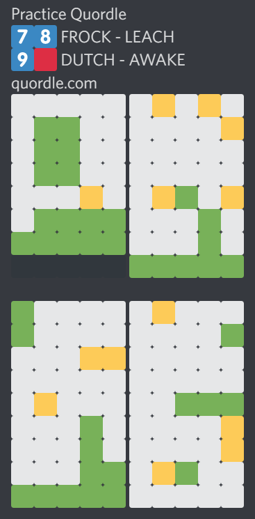
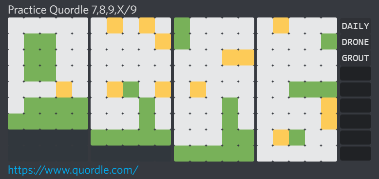

# disqordle 

A janky little Chrome extension to format Wordle and Quordle results in a Discord-friendly, Dordle-like manner.

## Usage
This extension adds a context menu item that, when clicked, formats the results of a Wordle or Quordle game and copies it to the clipboard.

1. On either the Wordle or Quordle website, right-click to open the context menu
2. From the context menu, select:
    - *Copy formatted Wordle results* (on Wordle)
        - Can be used on either a complete or incomplete game
        - *The settings page may briefly appear on the screen in order to check for hard mode*
    - *Copy formatted Quordle results* (on Quordle)
        - Only works on a complete game (either practice or daily)
3. Paste into Discord for sharing

### Example

Default | Formatted
---     | ---
 |  *Guesses are hidden using spoiler tags*

## Installation
*Only tested with Chrome, but might also work with other Chromium-based browsers.*
1. Download and unzip the [latest release](https://github.com/itsschwer/disqordle/releases)
2. In Chrome, navigate to the extensions page
    - *Settings (dropdown) \> More tools > Extensions*
    - or *`chrome://extensions//`*
3. Toggle on *Developer mode*  (top-right)
4. Click *Load unpacked*
5. In the file selector, navigate to and select the unzipped download from step 1.
6. *(Optional)* Click on *Details* for the newly added extension:
    - Toggle on *Allow in Incognito* (if playing in Incognito mode)
    - Toggle off *Allow access to file URLs* (access not needed)

 

**※** *Please don't upload this to the Chrome Web Store or other equivalents (unless substantial changes have been made)*
